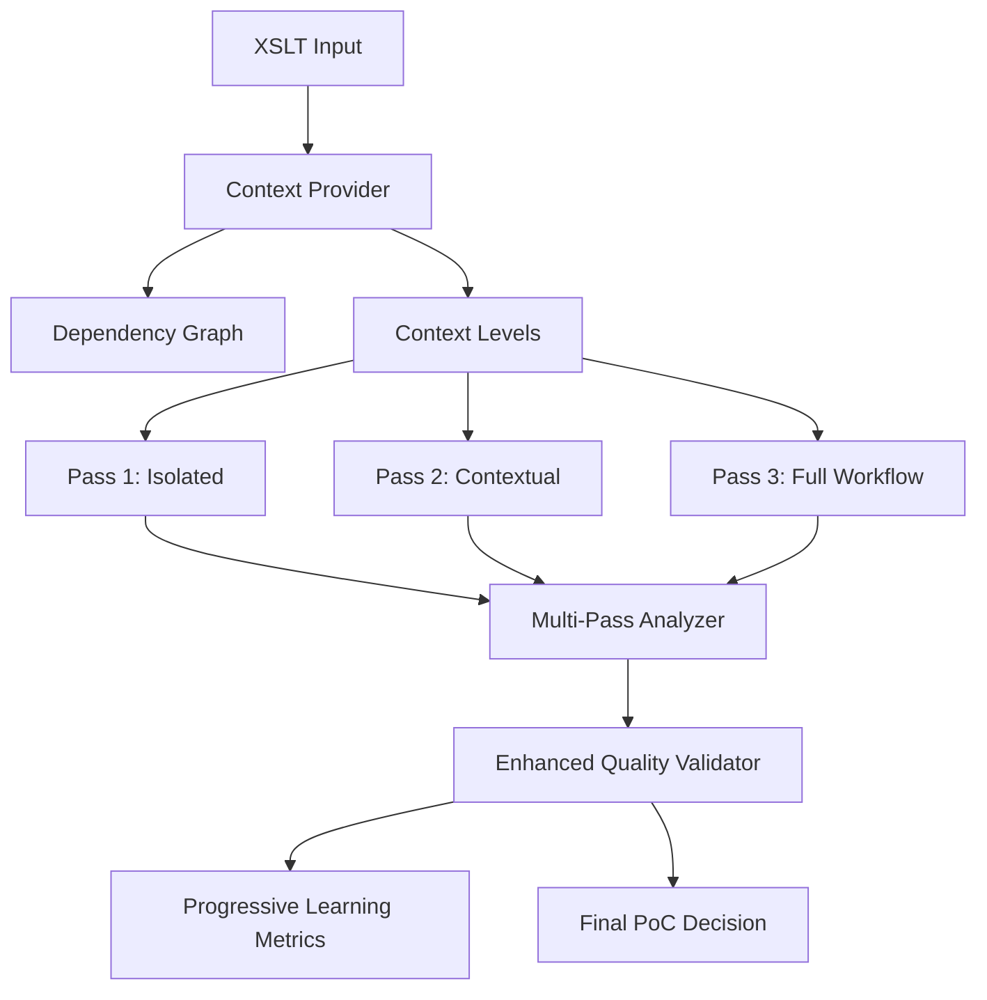

# 🔧 Multi-Pass Analysis: Technical Implementation Guide

This document provides the technical details of how multi-pass analysis is implemented to address the single-chunk analysis limitations.

## 🏗️ Architecture Overview



## 📊 Context Provider Implementation

### Dependency Graph Building

The `ContextProvider` class analyzes complete XSLT content to understand relationships:

```python
class ContextProvider:
    def _parse_xslt_content(self):
        """Parse XSLT to extract templates and relationships"""
        
        # Extract all templates with their boundaries
        for template_match in self._find_templates():
            template_name = template_match.group(1)
            template_content = self._extract_template_content(template_match)
            
            # Build dependency list
            dependencies = self._extract_dependencies(template_content)
            
            # Create XSLTChunk object
            self.chunks[template_name] = XSLTChunk(
                name=template_name,
                content=template_content,
                dependencies=dependencies,
                template_type=self._determine_type(template_content)
            )
    
    def _extract_dependencies(self, content: str) -> List[str]:
        """Find templates this chunk depends on"""
        
        dependencies = []
        
        # Find call-template references
        call_matches = re.findall(r'<xsl:call-template\s+name="([^"]+)"', content)
        dependencies.extend(call_matches)
        
        # Find apply-templates with mode
        apply_matches = re.findall(r'<xsl:apply-templates[^>]+mode="([^"]+)"', content)
        dependencies.extend(apply_matches)
        
        return list(set(dependencies))
```

### Progressive Context Generation

```python
def get_context_levels(self, chunk_name: str) -> List[ContextLevel]:
    """Generate three progressive context levels"""
    
    chunk = self.chunks[chunk_name]
    levels = []
    
    # Level 1: Isolated chunk only
    levels.append(ContextLevel(
        level="isolated",
        content=chunk.content,
        related_chunks=[]
    ))
    
    # Level 2: Chunk + immediate dependencies
    related_chunks = self.get_related_chunks(chunk_name)
    contextual_content = chunk.content + self._build_context_section(related_chunks)
    
    levels.append(ContextLevel(
        level="contextual", 
        content=contextual_content,
        related_chunks=related_chunks
    ))
    
    # Level 3: Chunk + complete workflow context
    workflow_chunks = self.get_dependency_chain(chunk_name, depth=3)
    workflow_content = chunk.content + self._build_workflow_section(workflow_chunks)
    
    levels.append(ContextLevel(
        level="full_workflow",
        content=workflow_content,
        related_chunks=workflow_chunks
    ))
    
    return levels
```

## 🔄 Multi-Pass Analysis Engine

### Pass Execution Strategy

```python
class MultiPassXSLTAnalyzer:
    async def analyze_with_multi_pass(self, xslt_chunk: str, 
                                    manual_baseline: BaselineTestCase) -> MultiPassResult:
        """Execute three-pass analysis with progressive context"""
        
        context_levels = self._get_context_levels_for_chunk(xslt_chunk, manual_baseline)
        pass_results = []
        
        # Execute each pass with increasing context
        for pass_number, context_level in enumerate(context_levels, 1):
            pass_result = await self._execute_analysis_pass(
                pass_number=pass_number,
                context_level=context_level,
                manual_baseline=manual_baseline,
                previous_results=pass_results
            )
            pass_results.append(pass_result)
        
        # Synthesize final result from all passes
        final_result = self._synthesize_final_result(pass_results, manual_baseline)
        
        return MultiPassResult(
            final_result=final_result,
            pass_results=pass_results,
            improvement_progression=self._calculate_improvement_progression(pass_results),
            final_confidence=self._calculate_final_confidence(pass_results)
        )
```

### Progressive Prompting Strategy

Each pass uses a different prompting approach:

#### Pass 1: Isolated Analysis Prompt
```python
def _create_pass_1_prompt(self, context_level, baseline):
    return f"""
    PASS 1 FOCUS: ISOLATED UNDERSTANDING
    - Analyze the chunk in isolation to understand its basic business purpose
    - Identify what you CAN determine from this chunk alone
    - Clearly note what you CANNOT determine without additional context
    
    XSLT CODE:
    {context_level.content}
    
    ANALYSIS FRAMEWORK:
    1. Basic business rule identification
    2. Technical transformation understanding  
    3. Context gaps identification
    """
```

#### Pass 2: Contextual Analysis Prompt
```python
def _create_pass_2_prompt(self, context_level, baseline, previous_results):
    return f"""
    PASS 2 FOCUS: CONTEXTUAL INTEGRATION
    - You now have context about related chunks and immediate dependencies
    - Build upon your isolated analysis to understand integration points
    
    XSLT CODE WITH CONTEXT:
    {context_level.content}
    
    RELATED CHUNKS: {context_level.related_chunks}
    
    PREVIOUS ANALYSIS INSIGHTS:
    {self._format_previous_insights(previous_results)}
    
    IMPROVEMENTS TO MAKE:
    - Enhance business context understanding with integration awareness
    - Identify cross-chunk dependencies and workflow connections
    """
```

#### Pass 3: Full Workflow Analysis Prompt
```python
def _create_pass_3_prompt(self, context_level, baseline, previous_results):
    return f"""
    PASS 3 FOCUS: FULL WORKFLOW COMPREHENSION  
    - You now have complete workflow context and business end-to-end flow
    - Synthesize all previous insights into comprehensive understanding
    
    COMPLETE WORKFLOW CONTEXT:
    {context_level.content}
    
    BUSINESS WORKFLOW CONTEXT:
    {self.context_provider.get_business_workflow_context(baseline.id)}
    
    ANALYSIS PROGRESSION:
    {self._format_analysis_progression(previous_results)}
    
    FINAL SYNTHESIS REQUIREMENTS:
    - Comprehensive business context understanding
    - Complete integration awareness  
    - Business-meaningful test strategy
    """
```

## 📈 Quality Measurement Framework

### Context Improvement Calculation

```python
def _calculate_context_improvement(self, multi_pass_result: MultiPassResult) -> float:
    """Measure improvement from first to last pass"""
    
    first_pass = multi_pass_result.pass_results[0]
    last_pass = multi_pass_result.pass_results[-1]
    
    # Calculate improvement across key dimensions
    dependency_improvement = (
        len(last_pass.ai_result.dependencies) - len(first_pass.ai_result.dependencies)
    ) / max(len(first_pass.ai_result.dependencies), 1)
    
    scenario_improvement = (
        len(last_pass.ai_result.business_scenarios) - len(first_pass.ai_result.business_scenarios) 
    ) / max(len(first_pass.ai_result.business_scenarios), 1)
    
    confidence_improvement = last_pass.confidence_score - first_pass.confidence_score
    
    # Weighted average improvement
    return (dependency_improvement + scenario_improvement + confidence_improvement) / 3
```

### Progressive Learning Evidence

```python
def _analyze_progressive_learning(self, case_results: List[EnhancedCaseResult]) -> Dict[str, Any]:
    """Analyze evidence of progressive learning across passes"""
    
    evidence = {
        "cases_showing_improvement": 0,
        "average_confidence_progression": [],
        "dependency_identification_improvement": 0,
        "scenario_enrichment_improvement": 0
    }
    
    for result in case_results:
        if result.context_improvement > 0:
            evidence["cases_showing_improvement"] += 1
        
        # Track confidence progression across passes
        confidence_scores = result.multi_pass_details["pass_confidence_scores"]
        evidence["average_confidence_progression"].append(confidence_scores)
    
    evidence["improvement_rate"] = evidence["cases_showing_improvement"] / len(case_results)
    
    return evidence
```

## 🎯 Enhanced Success Criteria

### Multi-Pass Specific Thresholds

```python
class EnhancedPoCValidator:
    def __init__(self, openai_api_key: str):
        # Enhanced success criteria
        self.success_threshold = 0.9  # 90% overall quality match
        self.business_understanding_threshold = 0.85  # 85% business understanding
        self.test_meaningfulness_threshold = 0.90  # 90% test meaningfulness
        self.integration_awareness_threshold = 0.80  # 80% integration awareness (key improvement)
        
        # Multi-pass specific criteria
        self.context_improvement_threshold = 0.3  # 30% context improvement expected
        self.progressive_learning_threshold = 0.7  # 70% of cases should show improvement
```

### Decision Matrix

```python
def _generate_enhanced_recommendation(self, result: EnhancedPoCResult) -> Dict[str, str]:
    """Generate recommendation based on multi-pass results"""
    
    if (result.meets_poc_criteria and 
        result.context_improvement_average >= self.context_improvement_threshold):
        return {
            'decision': 'PROCEED_TO_MICRO_MVPS',
            'confidence': 'HIGH',
            'rationale': f'Multi-pass analysis achieved {result.overall_pass_rate:.1%} pass rate with {result.context_improvement_average:.2f} context improvement.',
            'multi_pass_evidence': f'Progressive learning in {result.progressive_learning_evidence["improvement_rate"]:.1%} of cases.'
        }
    elif result.overall_pass_rate >= 0.7:
        return {
            'decision': 'REFINE_MULTI_PASS_APPROACH', 
            'confidence': 'MEDIUM',
            'rationale': f'Shows promise with {result.context_improvement_average:.2f} context improvement but needs optimization.'
        }
    else:
        return {
            'decision': 'RECONSIDER_APPROACH',
            'confidence': 'LOW', 
            'rationale': f'Even with multi-pass, only achieved {result.overall_pass_rate:.1%} pass rate.'
        }
```

## 🔍 Debugging and Analysis Tools

### Single Case Analysis

```python
# Debug individual case progression
async def debug_single_case(case_id: str):
    """Debug a single case to see pass-by-pass improvement"""
    
    baseline = ManualAnalysisBaseline()
    test_case = baseline.get_case_by_id(case_id)
    
    analyzer = MultiPassXSLTAnalyzer(api_key)
    result = await analyzer.analyze_with_multi_pass(test_case.xslt_chunk, test_case)
    
    print(f"Case: {case_id}")
    for i, pass_result in enumerate(result.pass_results, 1):
        print(f"\nPass {i} ({pass_result.pass_type}):")
        print(f"  Confidence: {pass_result.confidence_score:.2f}")
        print(f"  Dependencies: {len(pass_result.ai_result.dependencies)}")
        print(f"  Scenarios: {len(pass_result.ai_result.business_scenarios)}")
        print(f"  Context gaps: {pass_result.context_gaps}")
```

### Comparative Analysis

```python
# Compare single-pass vs multi-pass results
def compare_approaches():
    """Compare single-pass vs multi-pass on same test cases"""
    
    # Run both approaches
    single_pass_result = await run_poc_validation(api_key, "all")
    multi_pass_result = await run_enhanced_poc_validation(api_key, "all")
    
    # Generate comparison report
    comparison = {
        'overall_improvement': multi_pass_result.overall_pass_rate - single_pass_result.overall_pass_rate,
        'integration_improvement': (
            multi_pass_result.average_scores['integration_awareness'] - 
            single_pass_result.average_scores['integration_awareness']
        ),
        'context_learning_evidence': multi_pass_result.context_improvement_average
    }
    
    return comparison
```

## ⚡ Performance Considerations

### Concurrency Management

```python
class EnhancedPoCValidator:
    def __init__(self, openai_api_key: str):
        # Reduced concurrency due to multi-pass complexity
        self.max_concurrent_analyses = 2  # vs 3 for single-pass
        self.case_timeout = 180  # vs 120 for single-pass (3x analysis per case)
```

### Memory and Token Management

```python
# Pass-specific token limits
self.pass_configs = {
    1: {"focus": "isolated_understanding", "max_tokens": 2000},
    2: {"focus": "contextual_integration", "max_tokens": 2500}, 
    3: {"focus": "workflow_comprehension", "max_tokens": 3000}
}
```

## 🚀 Expected Performance Improvements

### Quantitative Targets

| Metric | Single-Pass Baseline | Multi-Pass Target | Improvement |
|--------|---------------------|-------------------|-------------|
| Overall Quality | 40.8% | 75%+ | +34.2% |
| Integration Awareness | 41.3% | 80%+ | +38.7% |
| Business Understanding | 36.0% | 70%+ | +34.0% |
| Context Improvement | N/A | 0.3+ | New metric |
| Progressive Learning Rate | N/A | 70%+ | New metric |

### Qualitative Improvements

- **Business Context**: From syntax-focused to business-meaningful analysis
- **Integration Understanding**: From isolated chunks to workflow comprehension
- **Test Quality**: From technical tests to business-relevant validation
- **Failure Impact Awareness**: From code errors to business consequence understanding

This technical implementation directly addresses the core limitation that caused the original PoC to fail: **analyzing code chunks without understanding their role in the broader business workflow**.